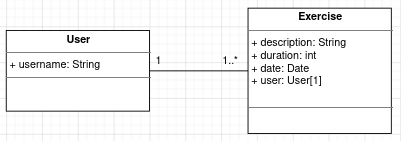

# Exercise Tracker

This application is made to complete the chalenge from [this free code camp project](https://www.freecodecamp.org/learn/apis-and-microservices/apis-and-microservices-projects/exercise-tracker).  
Express js and MongoDB is used to build the api.

[Live server](https://dashboard.heroku.com/apps/ancient-harbor-69699)

## Structure database application

Below is the UML asssociation diagram that shows relationship between models of this application.

> 

Above image describe that the **User** model has one or many **Exercise** model whereas **Exercise** has one **User**
